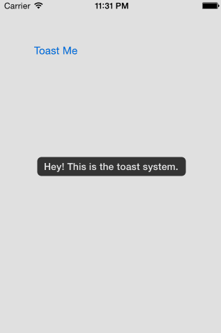

DTIToastCenter-Swift
====================

A toast center inspired from TKAlertCenter (tapku library) for displaying quick toast to the user written in full swift with great animation.
> Toasts are bounded to keyWindow to handle screen rotation and resize/move when keyboard is shown/hidden.

- [x] Center can be called from both swift or objc project.
- [x] This component require **Xcode6.1** to compile.

 &nbsp; 

### Installation

> For application targets that do not support embedded frameworks, such as iOS 7, DTIToastCenter can be integrated by including the `*.swift` source files directly.

_Due to the current lack of [proper infrastructure](http://cocoapods.org) for Swift dependency management, using DTIToastCenter in your project requires the following steps:_

1. Add DTIToastCenter as a [submodule](http://git-scm.com/docs/git-submodule) by opening the Terminal, `cd`-ing into your top-level project directory, and entering the command `git submodule add https://github.com/dtissera/DTIToastCenter-Swift.git`
2. Open the `DTIToastCenter` folder, and drag `DTIToastCenter.xcodeproj` into the file navigator of your app project.
3. In Xcode, navigate to the target configuration window by clicking on the blue project icon, and selecting the application target under the "Targets" heading in the sidebar.
4. Ensure that the deployment target of DTIToastCenter.framework matches that of the application target.
5. In the tab bar at the top of that window, open the "Build Phases" panel.
6. Expand the "Target Dependencies" group, and add `DTIToastCenter.framework`.
7. Click on the `+` button at the top left of the panel and select "New Copy Files Phase". Rename this new phase to "Copy Frameworks", set the "Destination" to "Frameworks", and add `DTIToastCenter.framework`.

---

### Usage

Initialize center in your application delegate to listen keyboard events

## objc
```objc
- (BOOL)application:(UIApplication *)application didFinishLaunchingWithOptions:(NSDictionary *)launchOptions {
    // Override point for customization after application launch.
    [[DTIToastCenter defaultCenter] registerCenter];
    return YES;
}
```

Post alert with text
```objc
[[DTIToastCenter defaultCenter] makeText:@"Hey! This is the toast system."];
```

Post alert with image
```objc
[[DTIToastCenter defaultCenter] makeImage:[UIImage imageNamed:@"swift"]];
```

Post alert with image and text
```objc
[[DTIToastCenter defaultCenter] makeText:@"Toast with image !" image:[UIImage imageNamed:@"swift"]];
```
